# ARC42 - CX Value-Add Service: Fraud Prevention

- [ARC42 - CX Value-Add Service: Fraud Prevention](#arc42---cx-value-add-service-fraud-prevention)
- [Introduction and Goals {#section-introduction-and-goals}](#introduction-and-goals-section-introduction-and-goals)
  - [Requirements Overview {#\_requirements\_overview}](#requirements-overview-_requirements_overview)
  - [Quality Goals {#\_quality\_goals}](#quality-goals-_quality_goals)
  - [Stakeholders {#\_stakeholders}](#stakeholders-_stakeholders)
- [Architecture Constraints {#section-architecture-constraints}](#architecture-constraints-section-architecture-constraints)
- [System Scope and Context {#section-system-scope-and-context}](#system-scope-and-context-section-system-scope-and-context)
  - [Business Context {#\_business\_context}](#business-context-_business_context)
  - [Technical Context {#\_technical\_context}](#technical-context-_technical_context)
- [Solution Strategy {#section-solution-strategy}](#solution-strategy-section-solution-strategy)
- [Building Block View {#section-building-block-view}](#building-block-view-section-building-block-view)
  - [Whitebox Overall System {#\_whitebox\_overall\_system}](#whitebox-overall-system-_whitebox_overall_system)
- [Runtime View {#section-runtime-view}](#runtime-view-section-runtime-view)
- [Deployment View {#section-deployment-view}](#deployment-view-section-deployment-view)
- [Architecture Decisions {#section-design-decisions}](#architecture-decisions-section-design-decisions)
- [Appendix A - Fraud Prevention Database](#appendix-a---fraud-prevention-database)
  - [Types of Fraud Cases](#types-of-fraud-cases)
  - [Fraud Alerts](#fraud-alerts)
  - [Fraud Database](#fraud-database)
  - [Potential Use Cases within the CX Community](#potential-use-cases-within-the-cx-community)
  - [Second Stage (to be defined and not implemented yet)](#second-stage-to-be-defined-and-not-implemented-yet)
- [Appendix B – Fraud Prevention: Modes of Operation](#appendix-b--fraud-prevention-modes-of-operation)
- [Appendix C - Fraud Prevention Access Management](#appendix-c---fraud-prevention-access-management)

# Introduction and Goals {#section-introduction-and-goals}

The Fraud Prevention functionality offers participants in the CX network to collect & share information about attempted frauds so that others can be aware of suspicious transactions. This functionality is currently designed as separate app with an own database not linked to the rest of the CX network, but visually integrated into the CX Portal. For simplicity reasons Fraud Prevention is listed in the building blocks landscape (see below) as a single CX Value- Add Service, while it is actually split across three distinct services, each covering a functional subset for handling fraud cases:

* The Fraud Reporter service lets a user enter the data necessary for describing and inputting fraud attempts, i.e. cases, into the system.
* The Fraud Browser service lets a user browse and look up the cases currently shared with all CX participants.
* The Fraud Viewer service lets a user display all data about a specific case.

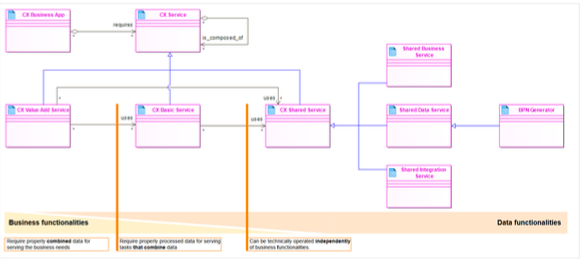

Note: As of 07 Apr 2022 and for CX Release 1 (and subsequent, as far as currently designed) this is based on the existing Fraud Prevention solution by a service provider (see Appendix A). In that regard, the service provider components appear as "black boxes" to the overall BPDM functionality, hence cannot be sufficiently documented to the point of whiteboxing in the ARC42, even if desired.

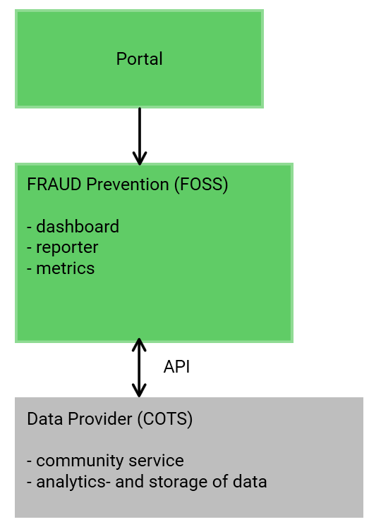

## Requirements Overview {#_requirements_overview}

Based on
* Fraud Prevention Database (see Appendix A)
the Fraud Prevention functionality shall be operable as an independent subsystem of BPDM but shall be pluggable as a dedicated (set of) service(s) into the overall Catena-X BPDM architecture.
Essentially constituting a service-oriented architecture running distributedly on distinct CX Nodes, there will typically be multiple consumers submitting fraud cases for shared use. To fulfil this purpose, the following requirements shall apply:

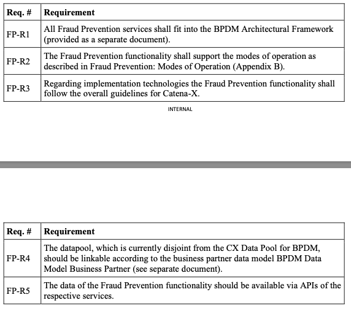

## Quality Goals {#_quality_goals}

The top three (max five) quality goals:
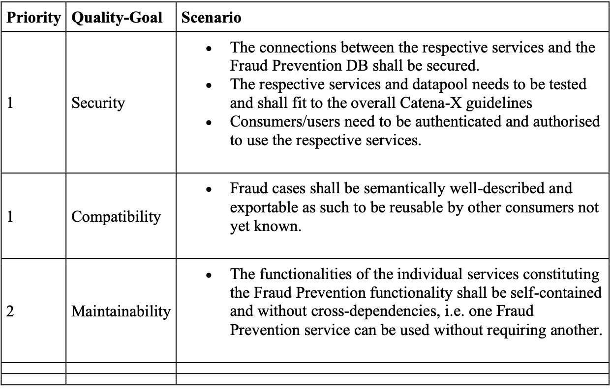

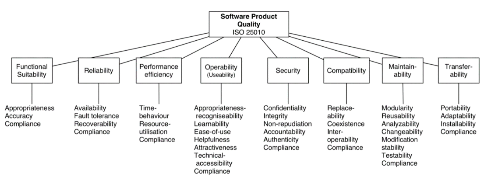

## Stakeholders {#_stakeholders}

# Architecture Constraints {#section-architecture-constraints}

* Follows the BPDM Architectural Framework (separate document)

# System Scope and Context {#section-system-scope-and-context}

The Fraud Prevention functionality acts as a separate subsystem within the CX network with own information management, conceptually tied to the BPDM but loosely linked at best (login, embedding in portal). Hence, the data storage (Fraud Prevention DB) is at this point isolated from the rest of CX.

## Business Context {#_business_context}

All communication partners.
See Fraud Prevention: Modes of Operation ([Appendix B](#appendix-b--fraud-prevention-modes-of-operation)) and Fraud Prevention Database ([Appendix A](#appendix-a---fraud-prevention-database)) and the following use case diagram.

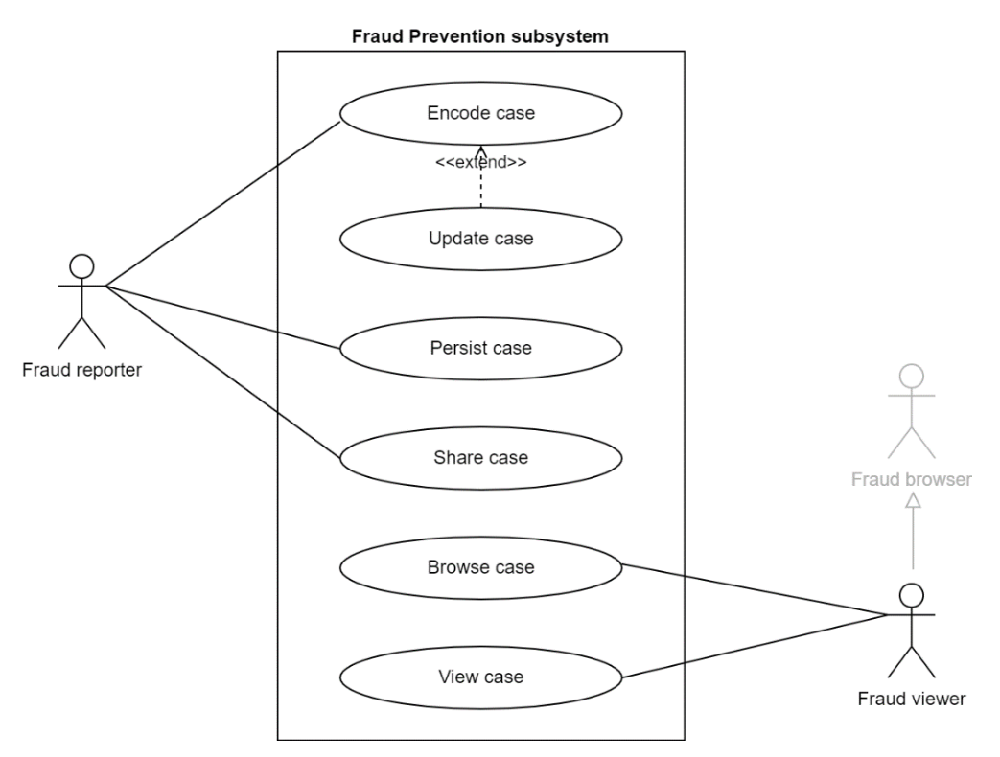

## Technical Context {#_technical_context}

See Fraud Prevention: Modes of Operation ([Appendix B](#appendix-b--fraud-prevention-modes-of-operation)) and Fraud Prevention Database ([Appendix A](#appendix-a---fraud-prevention-database)).

# Solution Strategy {#section-solution-strategy}

See Fraud Prevention: Modes of Operation ([Appendix B](#appendix-b--fraud-prevention-modes-of-operation)) and Fraud Prevention Database ([Appendix A](#appendix-a---fraud-prevention-database)).

# Building Block View {#section-building-block-view}

See Fraud Prevention: Modes of Operation ([Appendix B](#appendix-b--fraud-prevention-modes-of-operation)) and Fraud Prevention Database ([Appendix A](#appendix-a---fraud-prevention-database)).

## Whitebox Overall System {#_whitebox_overall_system}

See Fraud Prevention: Modes of Operation ([Appendix B](#appendix-b--fraud-prevention-modes-of-operation)) and Fraud Prevention Database ([Appendix A](#appendix-a---fraud-prevention-database)).

# Runtime View {#section-runtime-view}

See Fraud Prevention: Modes of Operation ([Appendix B](#appendix-b--fraud-prevention-modes-of-operation)) and Fraud Prevention Database ([Appendix A](#appendix-a---fraud-prevention-database)).

# Deployment View {#section-deployment-view}

See Fraud Prevention: Modes of Operation ([Appendix B](#appendix-b--fraud-prevention-modes-of-operation)) and Fraud Prevention Database ([Appendix A](#appendix-a---fraud-prevention-database)).
Helm Charts: GitHub - catenax-ng/product-vas-fraud-cd https://github.com/catenax-ng/product-vas-fraud-cd

# Architecture Decisions {#section-design-decisions}

See Fraud Prevention: Modes of Operation ([Appendix B](#appendix-b--fraud-prevention-modes-of-operation)) and Fraud Prevention Database ([Appendix A](#appendix-a---fraud-prevention-database)).

# Appendix A - Fraud Prevention Database

Companies are facing an ever increasing number of digitized frauds, meanwhile on a very professional level. Among other types, falsified invoices are causing significant financial damage, in some cases more than 1 Mio. USD by just one attack. One critical challenge to uncover those fraud attacks is to identify bank accounts (e.g. given by an invoice) which are not owned by the declared business partner (e.g. the supplier of an invoice) but by a third party, i.e. the attacker. The CX Data Sharing community is addressing this challenge by sharing information on known fraud cases and on proven bank accounts. The Fraud Case Database comprises known fraud cases, shared by community members. Other members can lookup these cases by bank account data (e.g. IBAN) to automate screening for critical accounts. On the other hand, the Whitelist comprises bank accounts which are declared "safe" by community members. You can lookup shared Trust Scores to check a new bank account and to ensure that this account is already used by another member.

## Types of Fraud Cases
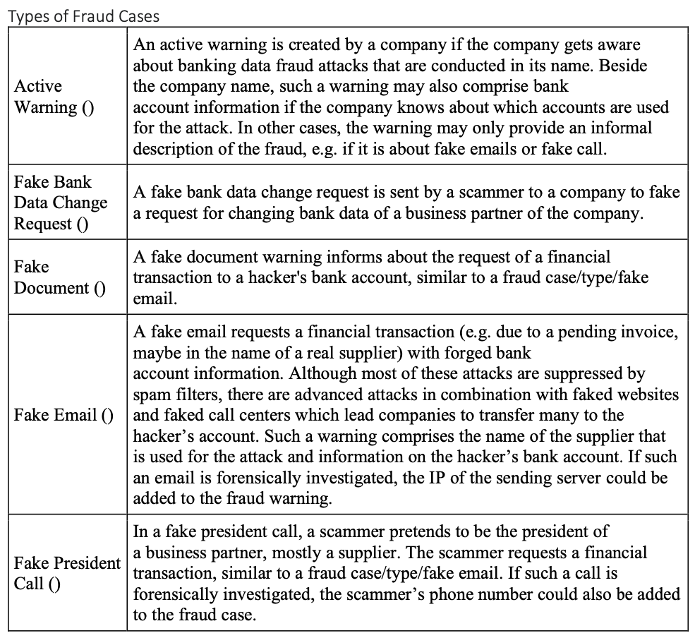
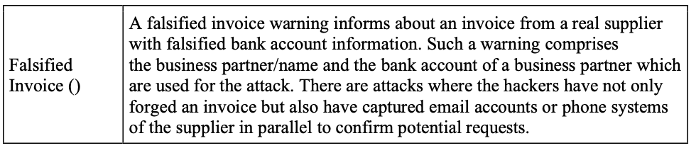

## Fraud Alerts
Enables to maintain an identified fraud attack in order to warn community members. The maintained fraud attack can then be broadcasted, as a so called payment fraud alert. When broadcasting the alert, all CX Data Sharing Community Members are informed about the particular case. The following information about a fraud attack can be disclosed to the community:
* General details, such as the type of fraud attack, the date, the state of confirmation
* Bank account
* Fraudster details, such as the used mail address, fake domain, fake name
While there is no minimum information required, fraud attacks disclosure is more meaningful to the community the more information is disclosed. That's why usually at least the used bank account details are shared.

## Fraud Database
The fraud database aggregates all anonymized fraud cases in order to enable the community to search for specific fraud cases and to monitor the current pool of business partners.

## Potential Use Cases within the CX Community

1. Using the Fraud Case App to consolidate own fraud cases of various systems that are recording bank data.

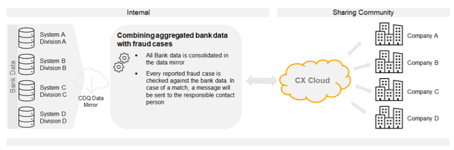

2. Monitoring own system data and publishing the cases only when verified internally.

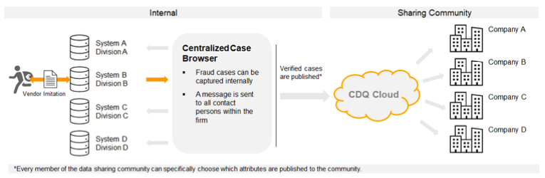

## Second Stage (to be defined and not implemented yet)

Disclosed fraud cases are shared with peers immediately. Organizations can maintain a recipients list for broadcasted fraud case alerts. When some member of the CX Data Sharing Community decides on broadcasting a fraud case alert all members of the recipients list are informed by email. It is possible to also continuously poll via API for new fraud cases in order to be independent on alerts via mail.  
Additionally, if a fraud case is disclosed and bank account information was maintained then also the Bank Account Trust Score (please check Bank Data Verification) is making use of the shared data. If a user wants to maintain a bank account and performs a trust score check he will be informed and warned about the involvement of the bank account in a fraud attack.

# Appendix B – Fraud Prevention: Modes of Operation

Based on the Architectural Framework (see separate document) and the preliminary works described in
* Fraud Prevention Database ([Appendix A](#appendix-a---fraud-prevention-database))  
the following assumptions are made for the modes of operation of the Fraud Prevention as a
CX Value-Add Service:

1. With its current and envisioned functionality, the Fraud Prevention functionality essentially resembles the common 4R cycle (Retrieve, Reuse, Revise, Retain) of Case-Based Reasoning (CBR) (https://de.wikipedia.org/wiki/Fallbasiertes_Schlie%C3%9Fen#/media/Datei:CbrCycle_basic_de.png). This provides a conceptual framework (https://de.wikipedia.org/wiki/Fallbasiertes_Schlie%C3%9Fen) for understanding and mapping the functions of the Fraud Prevention Process as follows (see also the figure below the table):

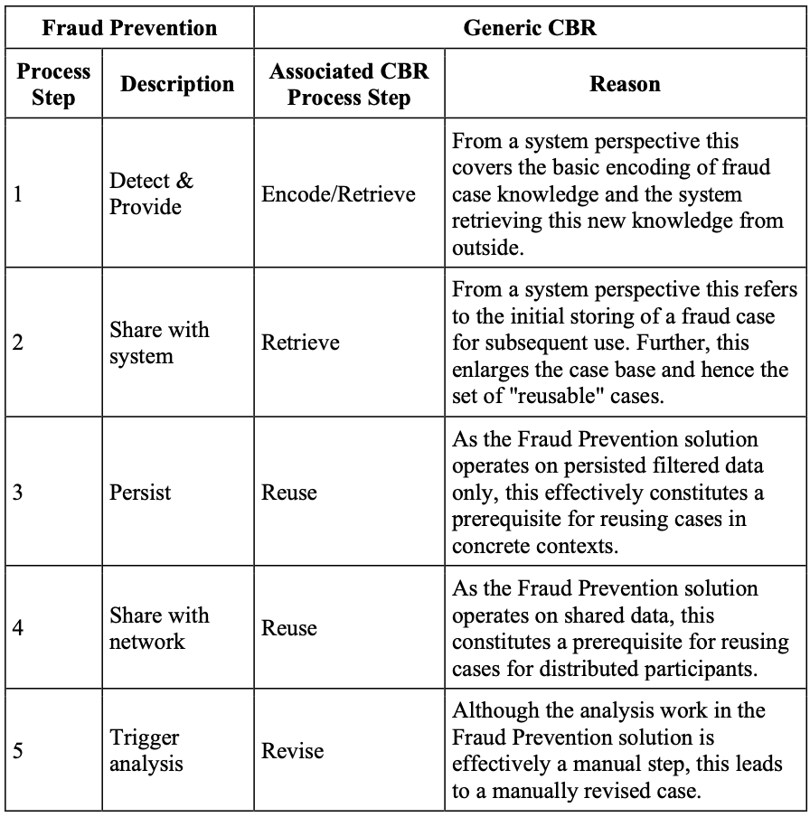
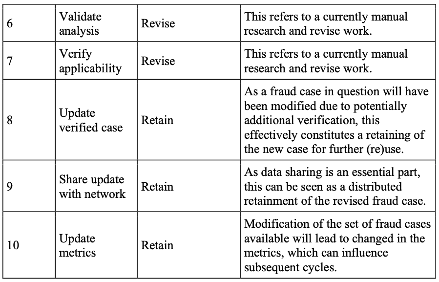

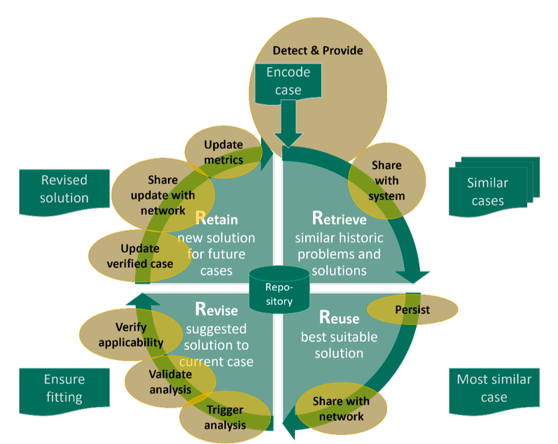

3. Currently, the Fraud Prevention process is operated fully manually. However, at a later time automated analytics and revising of cases can be added.
4. As the Fraud Prevention process is centered around the Fraud Prevention database, the different functions are split across/involve multiple services.
5. As all currently named services Fraud Reporter, Fraud Browser, Fraud Viewer are founded on and operate directly on the database, no special orchestration of services is involved in this setup.

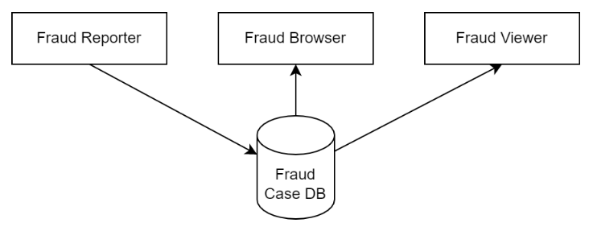

6. The process steps are achieved by interplay of these services.
7. The main entity (data object) is a "Fraud Case", which is continuously enriched and
revised. As such, there can be incomplete case data present. Analytics consider such
incompleteness for further results.
8. Being a manual process, there is currently no interface for bulk case provision
(encoding/retrieval).
9. Conceptually, the entire functionality could be bundled into one service artifact.
However, since there will be probably more clients using the database than contributors (relation contributors:clients likely n:m with n << m), maintaining the split and thus the CUD functions separate from the R is preferred.

# Appendix C - Fraud Prevention Access Management
The purpose of this section is to describe a first draft for the access management of the application Fraud Prevention for Release 1

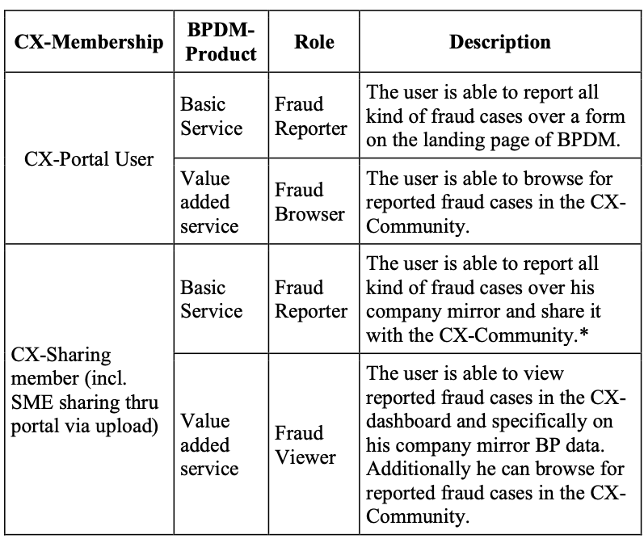
*For the final version there should be the option to split the roles for different kind of fraud cases (fake email, bank fraud, fake president call etc.).*