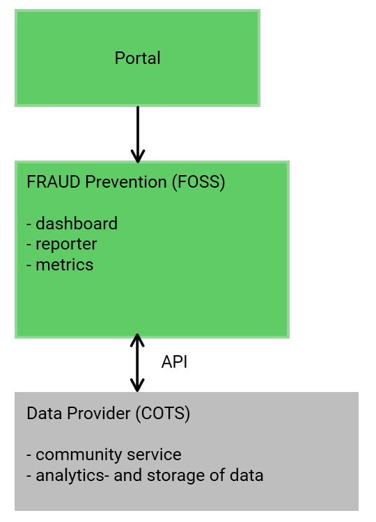
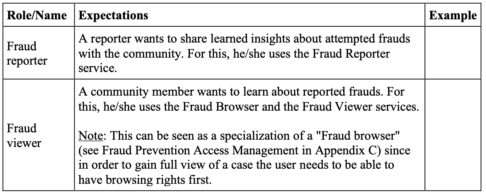
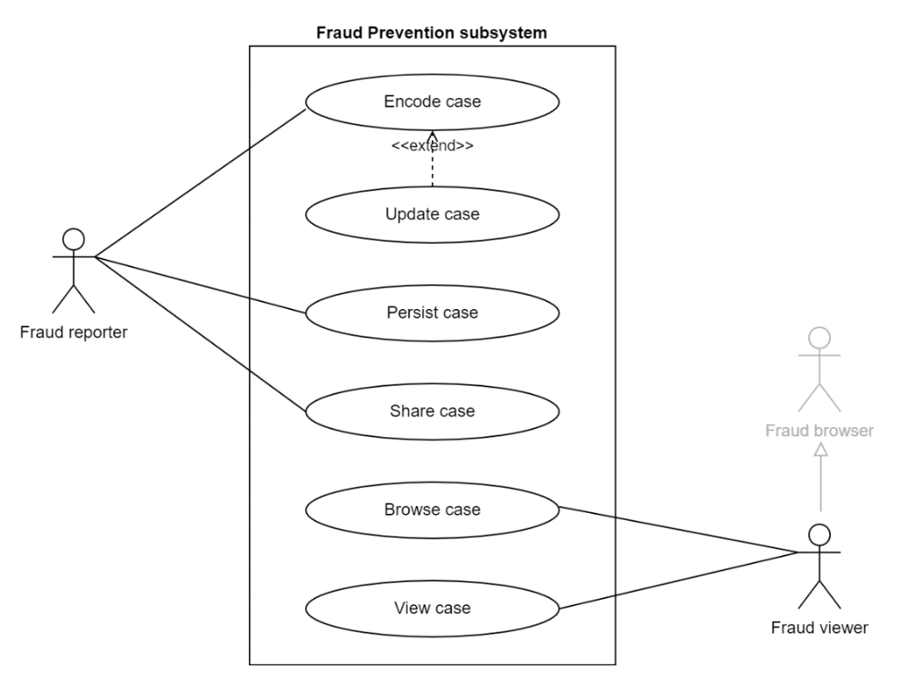
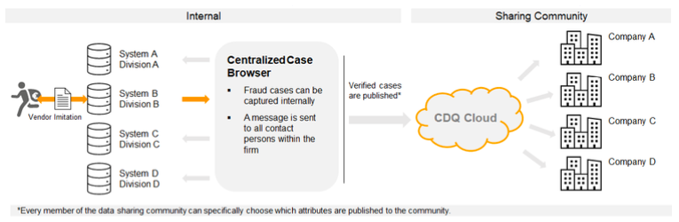
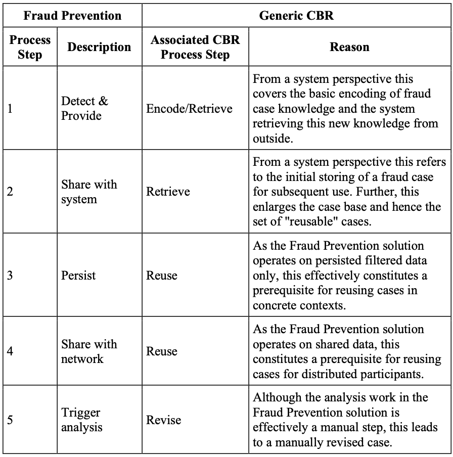
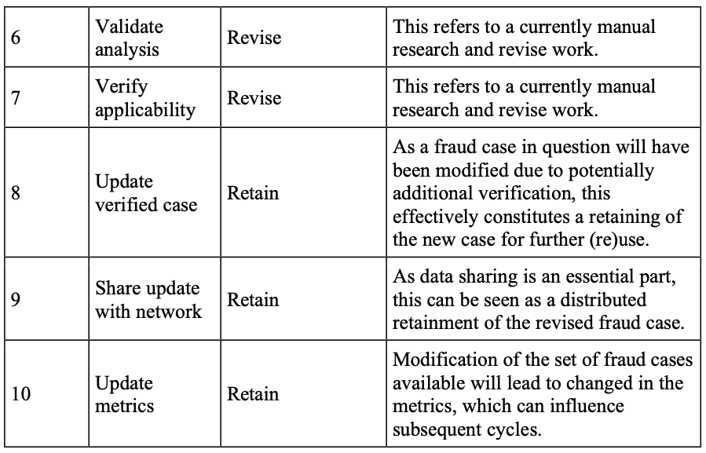
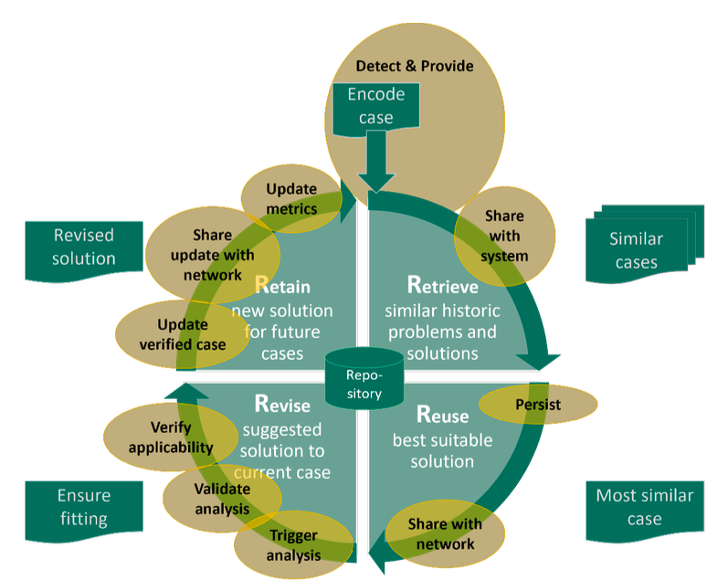
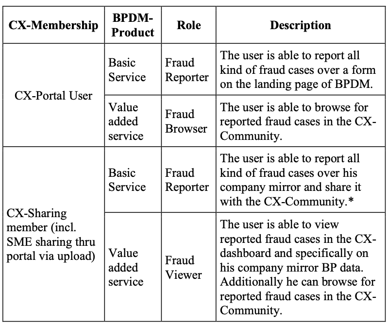

# ARC42 - CX Value-Add Service: Fraud Prevention

**About arc42**

arc42, the template for documentation of software and system
architecture.

Template Version 8.1 EN. (based upon AsciiDoc version), May 2022

Created, maintained and © by Dr. Peter Hruschka, Dr. Gernot Starke and
contributors. See <https://arc42.org>.

::: note
This version of the template contains some help and explanations. It is
used for familiarization with arc42 and the understanding of the
concepts. For documentation of your own system you use better the
*plain* version.
:::

- [ARC42 - CX Value-Add Service: Fraud Prevention](#arc42---cx-value-add-service-fraud-prevention)
- [Introduction and Goals {#section-introduction-and-goals}](#introduction-and-goals-section-introduction-and-goals)
  - [Requirements Overview {#_requirements_overview}](#requirements-overview-_requirements_overview)
  - [Quality Goals {#_quality_goals}](#quality-goals-_quality_goals)
  - [Stakeholders {#_stakeholders}](#stakeholders-_stakeholders)
- [Architecture Constraints {#section-architecture-constraints}](#architecture-constraints-section-architecture-constraints)
- [System Scope and Context {#section-system-scope-and-context}](#system-scope-and-context-section-system-scope-and-context)
  - [Business Context {#_business_context}](#business-context-_business_context)
  - [Technical Context {#_technical_context}](#technical-context-_technical_context)
- [Solution Strategy {#section-solution-strategy}](#solution-strategy-section-solution-strategy)
- [Building Block View {#section-building-block-view}](#building-block-view-section-building-block-view)
  - [Whitebox Overall System {#_whitebox_overall_system}](#whitebox-overall-system-_whitebox_overall_system)
    - [\<Name black box 1\> {#__name_black_box_1}](#name-black-box-1-__name_black_box_1)
    - [\<Name black box 2\> {#__name_black_box_2}](#name-black-box-2-__name_black_box_2)
    - [\<Name black box n\> {#__name_black_box_n}](#name-black-box-n-__name_black_box_n)
    - [\<Name interface 1\> {#__name_interface_1}](#name-interface-1-__name_interface_1)
    - [\<Name interface m\> {#__name_interface_m}](#name-interface-m-__name_interface_m)
  - [Level 2 {#_level_2}](#level-2-_level_2)
    - [White Box *\<building block 1\>* {#_white_box_emphasis_building_block_1_emphasis}](#white-box-building-block-1-_white_box_emphasis_building_block_1_emphasis)
    - [White Box *\<building block 2\>* {#_white_box_emphasis_building_block_2_emphasis}](#white-box-building-block-2-_white_box_emphasis_building_block_2_emphasis)
    - [White Box *\<building block m\>* {#_white_box_emphasis_building_block_m_emphasis}](#white-box-building-block-m-_white_box_emphasis_building_block_m_emphasis)
  - [Level 3 {#_level_3}](#level-3-_level_3)
    - [White Box \<\_building block x.1\_\> {#_white_box_building_block_x_1}](#white-box-_building-block-x1_-_white_box_building_block_x_1)
    - [White Box \<\_building block x.2\_\> {#_white_box_building_block_x_2}](#white-box-_building-block-x2_-_white_box_building_block_x_2)
    - [White Box \<\_building block y.1\_\> {#_white_box_building_block_y_1}](#white-box-_building-block-y1_-_white_box_building_block_y_1)
- [Runtime View {#section-runtime-view}](#runtime-view-section-runtime-view)
  - [\<Runtime Scenario 1\> {#__runtime_scenario_1}](#runtime-scenario-1-__runtime_scenario_1)
  - [\<Runtime Scenario 2\> {#__runtime_scenario_2}](#runtime-scenario-2-__runtime_scenario_2)
  - [... {#_}](#-_)
  - [\<Runtime Scenario n\> {#__runtime_scenario_n}](#runtime-scenario-n-__runtime_scenario_n)
- [Deployment View {#section-deployment-view}](#deployment-view-section-deployment-view)
  - [Infrastructure Level 1 {#_infrastructure_level_1}](#infrastructure-level-1-_infrastructure_level_1)
  - [Infrastructure Level 2 {#_infrastructure_level_2}](#infrastructure-level-2-_infrastructure_level_2)
    - [*\<Infrastructure Element 1\>* {#__emphasis_infrastructure_element_1_emphasis}](#infrastructure-element-1-__emphasis_infrastructure_element_1_emphasis)
    - [*\<Infrastructure Element 2\>* {#__emphasis_infrastructure_element_2_emphasis}](#infrastructure-element-2-__emphasis_infrastructure_element_2_emphasis)
    - [*\<Infrastructure Element n\>* {#__emphasis_infrastructure_element_n_emphasis}](#infrastructure-element-n-__emphasis_infrastructure_element_n_emphasis)
- [Cross-cutting Concepts {#section-concepts}](#cross-cutting-concepts-section-concepts)
  - [*\<Concept 1\>* {#__emphasis_concept_1_emphasis}](#concept-1-__emphasis_concept_1_emphasis)
  - [*\<Concept 2\>* {#__emphasis_concept_2_emphasis}](#concept-2-__emphasis_concept_2_emphasis)
  - [*\<Concept n\>* {#__emphasis_concept_n_emphasis}](#concept-n-__emphasis_concept_n_emphasis)
- [Architecture Decisions {#section-design-decisions}](#architecture-decisions-section-design-decisions)
- [Quality Requirements {#section-quality-scenarios}](#quality-requirements-section-quality-scenarios)
  - [Quality Tree {#_quality_tree}](#quality-tree-_quality_tree)
  - [Quality Scenarios {#_quality_scenarios}](#quality-scenarios-_quality_scenarios)
- [Risks and Technical Debts {#section-technical-risks}](#risks-and-technical-debts-section-technical-risks)
- [Glossary {#section-glossary}](#glossary-section-glossary)
- [Appendix A - Fraud Prevention Database](#appendix-a---fraud-prevention-database)
  - [Types of Fraud Cases](#types-of-fraud-cases)
  - [Fraud Alerts](#fraud-alerts)
  - [Fraud Database](#fraud-database)
  - [Potential Use Cases within the CX Community](#potential-use-cases-within-the-cx-community)
  - [Second Stage (to be defined and not implemented yet)](#second-stage-to-be-defined-and-not-implemented-yet)
- [Appendix B – Fraud Prevention: Modes of Operation](#appendix-b--fraud-prevention-modes-of-operation)
- [Appendix C - Fraud Prevention Access Management](#appendix-c---fraud-prevention-access-management)

# Introduction and Goals {#section-introduction-and-goals}

Describes the relevant requirements and the driving forces that software
architects and development team must consider. These include

-   underlying business goals,

-   essential features,

-   essential functional requirements,

-   quality goals for the architecture and

-   relevant stakeholders and their expectations

The Fraud Prevention functionality offers participants in the CX network to collect & share information about attempted frauds so that others can be aware of suspicious transactions. This functionality is currently designed as separate app with an own database not linked to the rest of the CX network, but visually integrated into the CX Portal. For simplicity reasons Fraud Prevention is listed in the building blocks landscape (see below) as a single CX Value- Add Service, while it is actually split across three distinct services, each covering a functional subset for handling fraud cases:

* The Fraud Reporter service lets a user enter the data necessary for describing and inputting fraud attempts, i.e. cases, into the system.
* The Fraud Browser service lets a user browse and look up the cases currently shared with all CX participants.
* The Fraud Viewer service lets a user display all data about a specific case.


Note: As of 07 Apr 2022 and for CX Release 1 (and subsequent, as far as currently designed) this is based on the existing Fraud Prevention solution by a service provider (see Appendix A). In that regard, the service provider components appear as "black boxes" to the overall BPDM functionality, hence cannot be sufficiently documented to the point of whiteboxing in the ARC42, even if desired.



## Requirements Overview {#_requirements_overview}

Based on
* Fraud Prevention Database (see Appendix A)
the Fraud Prevention functionality shall be operable as an independent subsystem of BPDM but shall be pluggable as a dedicated (set of) service(s) into the overall Catena-X BPDM architecture.
Essentially constituting a service-oriented architecture running distributedly on distinct CX Nodes, there will typically be multiple consumers submitting fraud cases for shared use. To fulfil this purpose, the following requirements shall apply:


::: formalpara-title
**Contents**
:::

Short description of the functional requirements, driving forces,
extract (or abstract) of requirements. Link to (hopefully existing)
requirements documents (with version number and information where to
find it).

::: formalpara-title
**Motivation**
:::

From the point of view of the end users a system is created or modified
to improve support of a business activity and/or improve the quality.

::: formalpara-title
**Form**
:::

Short textual description, probably in tabular use-case format. If
requirements documents exist this overview should refer to these
documents.

Keep these excerpts as short as possible. Balance readability of this
document with potential redundancy w.r.t to requirements documents.

See [Introduction and Goals](https://docs.arc42.org/section-1/) in the
arc42 documentation.

## Quality Goals {#_quality_goals}

The top three (max five) quality goals:


::: formalpara-title
**Contents**
:::

The top three (max five) quality goals for the architecture whose
fulfillment is of highest importance to the major stakeholders. We
really mean quality goals for the architecture. Don't confuse them with
project goals. They are not necessarily identical.

Consider this overview of potential topics (based upon the ISO 25010
standard):


::: formalpara-title
**Motivation**
:::

You should know the quality goals of your most important stakeholders,
since they will influence fundamental architectural decisions. Make sure
to be very concrete about these qualities, avoid buzzwords. If you as an
architect do not know how the quality of your work will be judged...

::: formalpara-title
**Form**
:::

A table with quality goals and concrete scenarios, ordered by priorities

## Stakeholders {#_stakeholders}



::: formalpara-title
**Contents**
:::

Explicit overview of stakeholders of the system, i.e. all person, roles
or organizations that

-   should know the architecture

-   have to be convinced of the architecture

-   have to work with the architecture or with code

-   need the documentation of the architecture for their work

-   have to come up with decisions about the system or its development

::: formalpara-title
**Motivation**
:::

You should know all parties involved in development of the system or
affected by the system. Otherwise, you may get nasty surprises later in
the development process. These stakeholders determine the extent and the
level of detail of your work and its results.

::: formalpara-title
**Form**
:::

Table with role names, person names, and their expectations with respect
to the architecture and its documentation.

+-------------+---------------------------+---------------------------+
| Role/Name   | Contact                   | Expectations              |
+=============+===========================+===========================+
| *           | *\<Contact-1\>*           | *\<Expectation-1\>*       |
| \<Role-1\>* |                           |                           |
+-------------+---------------------------+---------------------------+
| *           | *\<Contact-2\>*           | *\<Expectation-2\>*       |
| \<Role-2\>* |                           |                           |
+-------------+---------------------------+---------------------------+

# Architecture Constraints {#section-architecture-constraints}

* Follows the BPDM Architectural Framework (separate document)

::: formalpara-title
**Contents**
:::

Any requirement that constraints software architects in their freedom of
design and implementation decisions or decision about the development
process. These constraints sometimes go beyond individual systems and
are valid for whole organizations and companies.

::: formalpara-title
**Motivation**
:::

Architects should know exactly where they are free in their design
decisions and where they must adhere to constraints. Constraints must
always be dealt with; they may be negotiable, though.

::: formalpara-title
**Form**
:::

Simple tables of constraints with explanations. If needed you can
subdivide them into technical constraints, organizational and political
constraints and conventions (e.g. programming or versioning guidelines,
documentation or naming conventions)

See [Architecture Constraints](https://docs.arc42.org/section-2/) in the
arc42 documentation.

# System Scope and Context {#section-system-scope-and-context}

The Fraud Prevention functionality acts as a separate subsystem within the CX network with own information management, conceptually tied to the BPDM but loosely linked at best (login, embedding in portal). Hence, the data storage (Fraud Prevention DB) is at this point isolated from the rest of CX.

::: formalpara-title
**Contents**
:::

System scope and context - as the name suggests - delimits your system
(i.e. your scope) from all its communication partners (neighboring
systems and users, i.e. the context of your system). It thereby
specifies the external interfaces.

If necessary, differentiate the business context (domain specific inputs
and outputs) from the technical context (channels, protocols, hardware).

::: formalpara-title
**Motivation**
:::

The domain interfaces and technical interfaces to communication partners
are among your system's most critical aspects. Make sure that you
completely understand them.

::: formalpara-title
**Form**
:::

Various options:

-   Context diagrams

-   Lists of communication partners and their interfaces.

See [Context and Scope](https://docs.arc42.org/section-3/) in the arc42
documentation.

## Business Context {#_business_context}

All communication partners.
See Fraud Prevention: Modes of Operation (Appendix B) and Fraud Prevention Database (Appendix A) and the following use case diagram.



::: formalpara-title
**Contents**
:::

Specification of **all** communication partners (users, IT-systems, ...)
with explanations of domain specific inputs and outputs or interfaces.
Optionally you can add domain specific formats or communication
protocols.

::: formalpara-title
**Motivation**
:::

All stakeholders should understand which data are exchanged with the
environment of the system.

::: formalpara-title
**Form**
:::

All kinds of diagrams that show the system as a black box and specify
the domain interfaces to communication partners.

Alternatively (or additionally) you can use a table. The title of the
table is the name of your system, the three columns contain the name of
the communication partner, the inputs, and the outputs.

**\<Diagram or Table\>**

**\<optionally: Explanation of external domain interfaces\>**

## Technical Context {#_technical_context}

See Fraud Prevention: Modes of Operation (Appendix B) and Fraud Prevention Database (Appendix A).

::: formalpara-title
**Contents**
:::

Technical interfaces (channels and transmission media) linking your
system to its environment. In addition a mapping of domain specific
input/output to the channels, i.e. an explanation which I/O uses which
channel.

::: formalpara-title
**Motivation**
:::

Many stakeholders make architectural decision based on the technical
interfaces between the system and its context. Especially infrastructure
or hardware designers decide these technical interfaces.

::: formalpara-title
**Form**
:::

E.g. UML deployment diagram describing channels to neighboring systems,
together with a mapping table showing the relationships between channels
and input/output.

**\<Diagram or Table\>**

**\<optionally: Explanation of technical interfaces\>**

**\<Mapping Input/Output to Channels\>**

# Solution Strategy {#section-solution-strategy}

See Fraud Prevention: Modes of Operation (Appendix B) and Fraud Prevention Database (Appendix A).

::: formalpara-title
**Contents**
:::

A short summary and explanation of the fundamental decisions and
solution strategies, that shape system architecture. It includes

-   technology decisions

-   decisions about the top-level decomposition of the system, e.g.
    usage of an architectural pattern or design pattern

-   decisions on how to achieve key quality goals

-   relevant organizational decisions, e.g. selecting a development
    process or delegating certain tasks to third parties.

::: formalpara-title
**Motivation**
:::

These decisions form the cornerstones for your architecture. They are
the foundation for many other detailed decisions or implementation
rules.

::: formalpara-title
**Form**
:::

Keep the explanations of such key decisions short.

Motivate what was decided and why it was decided that way, based upon
problem statement, quality goals and key constraints. Refer to details
in the following sections.

See [Solution Strategy](https://docs.arc42.org/section-4/) in the arc42
documentation.

# Building Block View {#section-building-block-view}

See Fraud Prevention: Modes of Operation (Appendix B) and Fraud Prevention Database (Appendix A).

::: formalpara-title
**Content**
:::

The building block view shows the static decomposition of the system
into building blocks (modules, components, subsystems, classes,
interfaces, packages, libraries, frameworks, layers, partitions, tiers,
functions, macros, operations, data structures, ...) as well as their
dependencies (relationships, associations, ...)

This view is mandatory for every architecture documentation. In analogy
to a house this is the *floor plan*.

::: formalpara-title
**Motivation**
:::

Maintain an overview of your source code by making its structure
understandable through abstraction.

This allows you to communicate with your stakeholder on an abstract
level without disclosing implementation details.

::: formalpara-title
**Form**
:::

The building block view is a hierarchical collection of black boxes and
white boxes (see figure below) and their descriptions.


**Level 1** is the white box description of the overall system together
with black box descriptions of all contained building blocks.

**Level 2** zooms into some building blocks of level 1. Thus it contains
the white box description of selected building blocks of level 1,
together with black box descriptions of their internal building blocks.

**Level 3** zooms into selected building blocks of level 2, and so on.

See [Building Block View](https://docs.arc42.org/section-5/) in the
arc42 documentation.

## Whitebox Overall System {#_whitebox_overall_system}

See Fraud Prevention: Modes of Operation (Appendix B) and Fraud Prevention Database (Appendix A).

Here you describe the decomposition of the overall system using the
following white box template. It contains

-   an overview diagram

-   a motivation for the decomposition

-   black box descriptions of the contained building blocks. For these
    we offer you alternatives:

    -   use *one* table for a short and pragmatic overview of all
        contained building blocks and their interfaces

    -   use a list of black box descriptions of the building blocks
        according to the black box template (see below). Depending on
        your choice of tool this list could be sub-chapters (in text
        files), sub-pages (in a Wiki) or nested elements (in a modeling
        tool).

-   (optional:) important interfaces, that are not explained in the
    black box templates of a building block, but are very important for
    understanding the white box. Since there are so many ways to specify
    interfaces why do not provide a specific template for them. In the
    worst case you have to specify and describe syntax, semantics,
    protocols, error handling, restrictions, versions, qualities,
    necessary compatibilities and many things more. In the best case you
    will get away with examples or simple signatures.

***\<Overview Diagram\>***

Motivation

:   *\<text explanation\>*

Contained Building Blocks

:   *\<Description of contained building block (black boxes)\>*

Important Interfaces

:   *\<Description of important interfaces\>*

Insert your explanations of black boxes from level 1:

If you use tabular form you will only describe your black boxes with
name and responsibility according to the following schema:

+-----------------------+-----------------------------------------------+
| **Name**              | **Responsibility**                            |
+=======================+===============================================+
| *\<black box 1\>*     |  *\<Text\>*                                   |
+-----------------------+-----------------------------------------------+
| *\<black box 2\>*     |  *\<Text\>*                                   |
+-----------------------+-----------------------------------------------+

If you use a list of black box descriptions then you fill in a separate
black box template for every important building block . Its headline is
the name of the black box.

### \<Name black box 1\> {#__name_black_box_1}

Here you describe \<black box 1\> according the the following black box
template:

-   Purpose/Responsibility

-   Interface(s), when they are not extracted as separate paragraphs.
    This interfaces may include qualities and performance
    characteristics.

-   (Optional) Quality-/Performance characteristics of the black box,
    e.g.availability, run time behavior, ....

-   (Optional) directory/file location

-   (Optional) Fulfilled requirements (if you need traceability to
    requirements).

-   (Optional) Open issues/problems/risks

*\<Purpose/Responsibility\>*

*\<Interface(s)\>*

*\<(Optional) Quality/Performance Characteristics\>*

*\<(Optional) Directory/File Location\>*

*\<(Optional) Fulfilled Requirements\>*

*\<(optional) Open Issues/Problems/Risks\>*

### \<Name black box 2\> {#__name_black_box_2}

*\<black box template\>*

### \<Name black box n\> {#__name_black_box_n}

*\<black box template\>*

### \<Name interface 1\> {#__name_interface_1}

...

### \<Name interface m\> {#__name_interface_m}

## Level 2 {#_level_2}

Here you can specify the inner structure of (some) building blocks from
level 1 as white boxes.

You have to decide which building blocks of your system are important
enough to justify such a detailed description. Please prefer relevance
over completeness. Specify important, surprising, risky, complex or
volatile building blocks. Leave out normal, simple, boring or
standardized parts of your system

### White Box *\<building block 1\>* {#_white_box_emphasis_building_block_1_emphasis}

...describes the internal structure of *building block 1*.

*\<white box template\>*

### White Box *\<building block 2\>* {#_white_box_emphasis_building_block_2_emphasis}

*\<white box template\>*

...

### White Box *\<building block m\>* {#_white_box_emphasis_building_block_m_emphasis}

*\<white box template\>*

## Level 3 {#_level_3}

Here you can specify the inner structure of (some) building blocks from
level 2 as white boxes.

When you need more detailed levels of your architecture please copy this
part of arc42 for additional levels.

### White Box \<\_building block x.1\_\> {#_white_box_building_block_x_1}

Specifies the internal structure of *building block x.1*.

*\<white box template\>*

### White Box \<\_building block x.2\_\> {#_white_box_building_block_x_2}

*\<white box template\>*

### White Box \<\_building block y.1\_\> {#_white_box_building_block_y_1}

*\<white box template\>*

# Runtime View {#section-runtime-view}

See Fraud Prevention: Modes of Operation (Appendix B) and Fraud Prevention Database (Appendix A).

::: formalpara-title
**Contents**
:::

The runtime view describes concrete behavior and interactions of the
system's building blocks in form of scenarios from the following areas:

-   important use cases or features: how do building blocks execute
    them?

-   interactions at critical external interfaces: how do building blocks
    cooperate with users and neighboring systems?

-   operation and administration: launch, start-up, stop

-   error and exception scenarios

Remark: The main criterion for the choice of possible scenarios
(sequences, workflows) is their **architectural relevance**. It is
**not** important to describe a large number of scenarios. You should
rather document a representative selection.

::: formalpara-title
**Motivation**
:::

You should understand how (instances of) building blocks of your system
perform their job and communicate at runtime. You will mainly capture
scenarios in your documentation to communicate your architecture to
stakeholders that are less willing or able to read and understand the
static models (building block view, deployment view).

::: formalpara-title
**Form**
:::

There are many notations for describing scenarios, e.g.

-   numbered list of steps (in natural language)

-   activity diagrams or flow charts

-   sequence diagrams

-   BPMN or EPCs (event process chains)

-   state machines

-   ...

See [Runtime View](https://docs.arc42.org/section-6/) in the arc42
documentation.

## \<Runtime Scenario 1\> {#__runtime_scenario_1}

-   *\<insert runtime diagram or textual description of the scenario\>*

-   *\<insert description of the notable aspects of the interactions
    between the building block instances depicted in this diagram.\>*

## \<Runtime Scenario 2\> {#__runtime_scenario_2}

## ... {#_}

## \<Runtime Scenario n\> {#__runtime_scenario_n}

# Deployment View {#section-deployment-view}

See Fraud Prevention: Modes of Operation (Appendix B) and Fraud Prevention Database (Appendix A).
Helm Charts: GitHub - catenax-ng/product-vas-fraud-cd https://github.com/catenax-ng/product-vas-fraud-cd


::: formalpara-title
**Content**
:::

The deployment view describes:

1.  technical infrastructure used to execute your system, with
    infrastructure elements like geographical locations, environments,
    computers, processors, channels and net topologies as well as other
    infrastructure elements and

2.  mapping of (software) building blocks to that infrastructure
    elements.

Often systems are executed in different environments, e.g. development
environment, test environment, production environment. In such cases you
should document all relevant environments.

Especially document a deployment view if your software is executed as
distributed system with more than one computer, processor, server or
container or when you design and construct your own hardware processors
and chips.

From a software perspective it is sufficient to capture only those
elements of an infrastructure that are needed to show a deployment of
your building blocks. Hardware architects can go beyond that and
describe an infrastructure to any level of detail they need to capture.

::: formalpara-title
**Motivation**
:::

Software does not run without hardware. This underlying infrastructure
can and will influence a system and/or some cross-cutting concepts.
Therefore, there is a need to know the infrastructure.

Maybe a highest level deployment diagram is already contained in section
3.2. as technical context with your own infrastructure as ONE black box.
In this section one can zoom into this black box using additional
deployment diagrams:

-   UML offers deployment diagrams to express that view. Use it,
    probably with nested diagrams, when your infrastructure is more
    complex.

-   When your (hardware) stakeholders prefer other kinds of diagrams
    rather than a deployment diagram, let them use any kind that is able
    to show nodes and channels of the infrastructure.

See [Deployment View](https://docs.arc42.org/section-7/) in the arc42
documentation.

## Infrastructure Level 1 {#_infrastructure_level_1}

Describe (usually in a combination of diagrams, tables, and text):

-   distribution of a system to multiple locations, environments,
    computers, processors, .., as well as physical connections between
    them

-   important justifications or motivations for this deployment
    structure

-   quality and/or performance features of this infrastructure

-   mapping of software artifacts to elements of this infrastructure

For multiple environments or alternative deployments please copy and
adapt this section of arc42 for all relevant environments.

***\<Overview Diagram\>***

Motivation

:   *\<explanation in text form\>*

Quality and/or Performance Features

:   *\<explanation in text form\>*

Mapping of Building Blocks to Infrastructure

:   *\<description of the mapping\>*

## Infrastructure Level 2 {#_infrastructure_level_2}

Here you can include the internal structure of (some) infrastructure
elements from level 1.

Please copy the structure from level 1 for each selected element.

### *\<Infrastructure Element 1\>* {#__emphasis_infrastructure_element_1_emphasis}

*\<diagram + explanation\>*

### *\<Infrastructure Element 2\>* {#__emphasis_infrastructure_element_2_emphasis}

*\<diagram + explanation\>*

...

### *\<Infrastructure Element n\>* {#__emphasis_infrastructure_element_n_emphasis}

*\<diagram + explanation\>*

# Cross-cutting Concepts {#section-concepts}

::: formalpara-title
**Content**
:::

This section describes overall, principal regulations and solution ideas
that are relevant in multiple parts (= cross-cutting) of your system.
Such concepts are often related to multiple building blocks. They can
include many different topics, such as

-   models, especially domain models

-   architecture or design patterns

-   rules for using specific technology

-   principal, often technical decisions of an overarching (=
    cross-cutting) nature

-   implementation rules

::: formalpara-title
**Motivation**
:::

Concepts form the basis for *conceptual integrity* (consistency,
homogeneity) of the architecture. Thus, they are an important
contribution to achieve inner qualities of your system.

Some of these concepts cannot be assigned to individual building blocks,
e.g. security or safety.

::: formalpara-title
**Form**
:::

The form can be varied:

-   concept papers with any kind of structure

-   cross-cutting model excerpts or scenarios using notations of the
    architecture views

-   sample implementations, especially for technical concepts

-   reference to typical usage of standard frameworks (e.g. using
    Hibernate for object/relational mapping)

::: formalpara-title
**Structure**
:::

A potential (but not mandatory) structure for this section could be:

-   Domain concepts

-   User Experience concepts (UX)

-   Safety and security concepts

-   Architecture and design patterns

-   \"Under-the-hood\"

-   development concepts

-   operational concepts

Note: it might be difficult to assign individual concepts to one
specific topic on this list.


See [Concepts](https://docs.arc42.org/section-8/) in the arc42
documentation.

## *\<Concept 1\>* {#__emphasis_concept_1_emphasis}

*\<explanation\>*

## *\<Concept 2\>* {#__emphasis_concept_2_emphasis}

*\<explanation\>*

...

## *\<Concept n\>* {#__emphasis_concept_n_emphasis}

*\<explanation\>*

# Architecture Decisions {#section-design-decisions}

See Fraud Prevention: Modes of Operation (Appendix B) and Fraud Prevention Database (Appendix A).

::: formalpara-title
**Contents**
:::

Important, expensive, large scale or risky architecture decisions
including rationales. With \"decisions\" we mean selecting one
alternative based on given criteria.

Please use your judgement to decide whether an architectural decision
should be documented here in this central section or whether you better
document it locally (e.g. within the white box template of one building
block).

Avoid redundancy. Refer to section 4, where you already captured the
most important decisions of your architecture.

::: formalpara-title
**Motivation**
:::

Stakeholders of your system should be able to comprehend and retrace
your decisions.

::: formalpara-title
**Form**
:::

Various options:

-   ADR ([Documenting Architecture
    Decisions](https://cognitect.com/blog/2011/11/15/documenting-architecture-decisions))
    for every important decision

-   List or table, ordered by importance and consequences or:

-   more detailed in form of separate sections per decision

See [Architecture Decisions](https://docs.arc42.org/section-9/) in the
arc42 documentation. There you will find links and examples about ADR.

# Quality Requirements {#section-quality-scenarios}

::: formalpara-title
**Content**
:::

This section contains all quality requirements as quality tree with
scenarios. The most important ones have already been described in
section 1.2. (quality goals)

Here you can also capture quality requirements with lesser priority,
which will not create high risks when they are not fully achieved.

::: formalpara-title
**Motivation**
:::

Since quality requirements will have a lot of influence on architectural
decisions you should know for every stakeholder what is really important
to them, concrete and measurable.

See [Quality Requirements](https://docs.arc42.org/section-10/) in the
arc42 documentation.

## Quality Tree {#_quality_tree}

::: formalpara-title
**Content**
:::

The quality tree (as defined in ATAM -- Architecture Tradeoff Analysis
Method) with quality/evaluation scenarios as leafs.

::: formalpara-title
**Motivation**
:::

The tree structure with priorities provides an overview for a sometimes
large number of quality requirements.

::: formalpara-title
**Form**
:::

The quality tree is a high-level overview of the quality goals and
requirements:

-   tree-like refinement of the term \"quality\". Use \"quality\" or
    \"usefulness\" as a root

-   a mind map with quality categories as main branches

In any case the tree should include links to the scenarios of the
following section.

## Quality Scenarios {#_quality_scenarios}

::: formalpara-title
**Contents**
:::

Concretization of (sometimes vague or implicit) quality requirements
using (quality) scenarios.

These scenarios describe what should happen when a stimulus arrives at
the system.

For architects, two kinds of scenarios are important:

-   Usage scenarios (also called application scenarios or use case
    scenarios) describe the system's runtime reaction to a certain
    stimulus. This also includes scenarios that describe the system's
    efficiency or performance. Example: The system reacts to a user's
    request within one second.

-   Change scenarios describe a modification of the system or of its
    immediate environment. Example: Additional functionality is
    implemented or requirements for a quality attribute change.

::: formalpara-title
**Motivation**
:::

Scenarios make quality requirements concrete and allow to more easily
measure or decide whether they are fulfilled.

Especially when you want to assess your architecture using methods like
ATAM you need to describe your quality goals (from section 1.2) more
precisely down to a level of scenarios that can be discussed and
evaluated.

::: formalpara-title
**Form**
:::

Tabular or free form text.

# Risks and Technical Debts {#section-technical-risks}

::: formalpara-title
**Contents**
:::

A list of identified technical risks or technical debts, ordered by
priority

::: formalpara-title
**Motivation**
:::

"Risk management is project management for grown-ups" (Tim Lister,
Atlantic Systems Guild.)

This should be your motto for systematic detection and evaluation of
risks and technical debts in the architecture, which will be needed by
management stakeholders (e.g. project managers, product owners) as part
of the overall risk analysis and measurement planning.

::: formalpara-title
**Form**
:::

List of risks and/or technical debts, probably including suggested
measures to minimize, mitigate or avoid risks or reduce technical debts.

See [Risks and Technical Debt](https://docs.arc42.org/section-11/) in
the arc42 documentation.

# Glossary {#section-glossary}

::: formalpara-title
**Contents**
:::

The most important domain and technical terms that your stakeholders use
when discussing the system.

You can also see the glossary as source for translations if you work in
multi-language teams.

::: formalpara-title
**Motivation**
:::

You should clearly define your terms, so that all stakeholders

-   have an identical understanding of these terms

-   do not use synonyms and homonyms

```{=html}
<!-- -->
```
-   A table with columns \<Term\> and \<Definition\>.

-   Potentially more columns in case you need translations.

See [Glossary](https://docs.arc42.org/section-12/) in the arc42
documentation.

+-----------------------+-----------------------------------------------+
| Term                  | Definition                                    |
+=======================+===============================================+
| *\<Term-1\>*          | *\<definition-1\>*                            |
+-----------------------+-----------------------------------------------+
| *\<Term-2\>*          | *\<definition-2\>*                            |
+-----------------------+-----------------------------------------------+

# Appendix A - Fraud Prevention Database

Companies are facing an ever increasing number of digitized frauds, meanwhile on a very professional level. Among other types, falsified invoices are causing significant financial damage, in some cases more than 1 Mio. USD by just one attack. One critical challenge to uncover those fraud attacks is to identify bank accounts (e.g. given by an invoice) which are not owned by the declared business partner (e.g. the supplier of an invoice) but by a third party, i.e. the attacker. The CX Data Sharing community is addressing this challenge by sharing information on known fraud cases and on proven bank accounts. The Fraud Case Database comprises known fraud cases, shared by community members. Other members can lookup these cases by bank account data (e.g. IBAN) to automate screening for critical accounts. On the other hand, the Whitelist comprises bank accounts which are declared "safe" by community members. You can lookup shared Trust Scores to check a new bank account and to ensure that this account is already used by another member.

## Types of Fraud Cases


## Fraud Alerts
Enables to maintain an identified fraud attack in order to warn community members. The maintained fraud attack can then be broadcasted, as a so called payment fraud alert. When broadcasting the alert, all CX Data Sharing Community Members are informed about the particular case. The following information about a fraud attack can be disclosed to the community:
* General details, such as the type of fraud attack, the date, the state of confirmation
* Bank account
* Fraudster details, such as the used mail address, fake domain, fake name
While there is no minimum information required, fraud attacks disclosure is more meaningful to the community the more information is disclosed. That's why usually at least the used bank account details are shared.

## Fraud Database
The fraud database aggregates all anonymized fraud cases in order to enable the community to search for specific fraud cases and to monitor the current pool of business partners.

## Potential Use Cases within the CX Community

1. Using the Fraud Case App to consolidate own fraud cases of various systems that are recording bank data.


2. Monitoring own system data and publishing the cases only when verified internally.



## Second Stage (to be defined and not implemented yet)

Disclosed fraud cases are shared with peers immediately. Organizations can maintain a recipients list for broadcasted fraud case alerts. When some member of the CX Data Sharing Community decides on broadcasting a fraud case alert all members of the recipients list are informed by email. It is possible to also continuously poll via API for new fraud cases in order to be independent on alerts via mail. <br>
Additionally, if a fraud case is disclosed and bank account information was maintained then also the Bank Account Trust Score (please check Bank Data Verification) is making use of the shared data. If a user wants to maintain a bank account and performs a trust score check he will be informed and warned about the involvement of the bank account in a fraud attack.

# Appendix B – Fraud Prevention: Modes of Operation

Based on the Architectural Framework (see separate document) and the preliminary works described in
* Fraud Prevention Database (Appendix A) <br>
the following assumptions are made for the modes of operation of the Fraud Prevention as a
CX Value-Add Service:

1. With its current and envisioned functionality, the Fraud Prevention functionality essentially resembles the common 4R cycle (Retrieve, Reuse, Revise, Retain) of Case-Based Reasoning (CBR) (https://de.wikipedia.org/wiki/Fallbasiertes_Schlie%C3%9Fen#/media/Datei:CbrCycle_basic_de.png). This provides a conceptual framework (https://de.wikipedia.org/wiki/Fallbasiertes_Schlie%C3%9Fen) for understanding and mapping the functions of the Fraud Prevention Process as follows (see also the figure below the table):






3. Currently, the Fraud Prevention process is operated fully manually. However, at a later time automated analytics and revising of cases can be added.
4. As the Fraud Prevention process is centered around the Fraud Prevention database, the different functions are split across/involve multiple services.
5. As all currently named services Fraud Reporter, Fraud Browser, Fraud Viewer are founded on and operate directly on the database, no special orchestration of services is involved in this setup.


6. The process steps are achieved by interplay of these services.
7. The main entity (data object) is a "Fraud Case", which is continuously enriched and
revised. As such, there can be incomplete case data present. Analytics consider such
incompleteness for further results.
8. Being a manual process, there is currently no interface for bulk case provision
(encoding/retrieval).
9. Conceptually, the entire functionality could be bundled into one service artifact.
However, since there will be probably more clients using the database than contributors (relation contributors:clients likely n:m with n << m), maintaining the split and thus the CUD functions separate from the R is preferred.

# Appendix C - Fraud Prevention Access Management
The purpose of this section is to describe a first draft for the access management of the application Fraud Prevention for Release 1


*For the final version there should be the option to split the roles for different kind of fraud cases (fake email, bank fraud, fake president call etc.).*